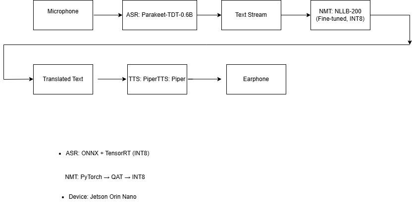

# On-Device Speech Translation System (ASR → NMT → TTS)

This project explores the design and optimization of a **real-time, on-device speech translation system** with a focus on **latency, efficiency, and user privacy**. The system runs fully offline on an NVIDIA Jetson Orin Nano.

## System Architecture

## Models
- **ASR:** Parakeet-TDT-0.6B (INT8, TensorRT)
- **NMT:** NLLB-200 (fine-tuned in PyTorch, PTQ)
- **TTS:** Piper

## Translation Quality
| Model | ChrF++ |
|-----|------|
| NLLB-200 (Base) | **67.33** |
| NLLB-200 (Fine-tuned) | **67.28** |

## Key Contributions
- Fine-tuned NLLB-200 for engineering-domain translation
- Applied Post Training Quantization for efficient INT8 inference
- Deployed optimized ASR and NMT models using ONNX and TensorRT
- Benchmarked latency and translation quality on embedded GPU

## Hardware
- NVIDIA Jetson Orin Nano
- WM8960 Audio Codec

## Motivation
This work investigates practical trade-offs in deploying **speech and machine translation models on-device**, aligning with privacy-preserving ML system design.
